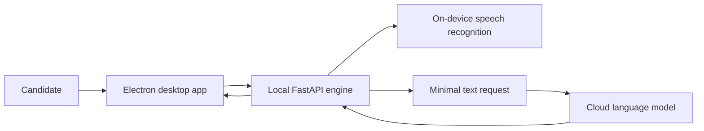

# План подготовки SkillCue к грантовым заявкам

> **Для agentic workers:** ОБЯЗАТЕЛЬНЫЙ SUB-SKILL: использовать superpowers:executing-plans и выполнять задачи последовательно с отметками `- [ ]`.

**Цель:** подготовить лендинг, публичную GitHub-витрину и англоязычный пакет заявок SkillCue для AWS Activate Founders и Google for Startups Cloud Start.

**Архитектура:** коммерческий код остаётся в закрытом репозитории `C:\dev\interview`. Лендинг меняется точечно в существующей статической странице, публичный репозиторий содержит только релизы и проверяемые материалы о продукте, а документы заявок хранятся отдельно в `docs/grants/`. Проверки формулировок и ссылок автоматизируются одним Node.js-скриптом без новых зависимостей.

**Технологии:** статический HTML/CSS/JavaScript, Node.js 20+, PowerShell, Git/GitHub, Markdown, Electron, FastAPI.

## Общие ограничения

- Стадия продукта: работающий MVP перед публичным запуском, без пользователей и выручки.
- Не публиковать коммерческий исходный код, промпты, ключи, секреты, приватные пути и пользовательские данные.
- Не заявлять существование вьетнамского юридического лица, инвестиций, партнёров, пользователей, выручки или уже полученного гранта.
- Позиционировать SkillCue прежде всего как инструмент подготовки; live-режим описывать только как дополнительный доступ к заранее подготовленным материалам с учётом правил интервью.
- Сохранить текущий визуальный стиль лендинга и не переделывать приложение ради заявки.
- Не включать существующие незавершённые изменения приложения в коммиты этой работы.
- Переименование публичного репозитория, публикация изменений и отправка форм требуют подтверждения непосредственно перед действием.

## Структура файлов

- `landing/index.html` — основная публичная страница и всё пользовательское позиционирование.
- `landing/privacy.html` — точное описание границ локальной и облачной обработки данных.
- `landing/requisites.html` — юридически нейтральное описание продукта.
- `landing/skillcue-vs-chatgpt.html` — SEO-страница, формулировки которой должны совпадать с ответственным позиционированием.
- `scripts/check-grant-packaging.mjs` — автоматическая проверка запрещённых заявлений, обязательных разделов и локальных ссылок.
- `.github/workflows/ci.yml` — запуск проверки упаковки в CI.
- `apps/desktop/package.json` — имя целевого release-репозитория после переименования.
- `.github/workflows/release.yml` — актуальные комментарии и имя секрета релизного репозитория.
- `docs/grants/product-dossier.md` — единый достоверный источник для заявок.
- `docs/grants/aws-activate.md` — ответы и план использования ресурсов для AWS.
- `docs/grants/google-for-startups.md` — ответы и план использования ресурсов для Google.
- `docs/grants/founder-checklist.md` — только сведения и действия, которые должен предоставить основатель.
- `C:\dev\skillcue-showcase\README.md` — публичная витрина продукта.
- `C:\dev\skillcue-showcase\docs\architecture.md` — безопасная публичная схема потоков данных.
- `C:\dev\skillcue-showcase\SECURITY.md` — канал ответственного сообщения об уязвимостях.
- `C:\dev\skillcue-showcase\RESPONSIBLE_USE.md` — публичные правила использования.
- `C:\dev\skillcue-showcase\ROADMAP.md` — честный roadmap pre-launch MVP.
- `C:\dev\skillcue-showcase\assets\` — отобранные скриншоты без секретов и персональных данных.

---

### Задача 1: Автоматическая проверка грантовой упаковки

**Файлы:**
- Создать: `scripts/check-grant-packaging.mjs`
- Изменить: `.github/workflows/ci.yml`

**Интерфейсы:**
- Получает: HTML и Markdown из `landing/`, `docs/grants/` и корня проекта.
- Возвращает: код `0` и строку `Grant packaging checks passed`, либо код `1` со списком нарушений.

- [ ] **Шаг 1: написать проверку, которая сначала падает на текущих формулировках**

Скрипт должен рекурсивно читать только текстовые файлы из разрешённых каталогов и проверять:

```js
const forbidden = [
  /скрыт от (?:записи|демонстрации) экрана/iu,
  /незаметн(?:ый|ая|о).*чит/iu,
  /cheat on/iu,
  /штаб-квартир\w* во вьетнаме/iu,
];

const requiredLandingPhrases = [
  'подготовк',
  'пробн',
  'локальн',
  'ответственн',
  'MVP',
];
```

Для `href` со значениями, начинающимися с `./`, `../` или `/`, скрипт должен удалить query/hash, разрешить путь относительно HTML-файла или `landing/` и убедиться, что целевой файл существует. Ссылку `/downloads/SkillCue-Setup.exe` нужно явно исключить как серверный release-alias.

- [ ] **Шаг 2: запустить проверку и подтвердить ожидаемое падение**

Команда:

```powershell
node scripts/check-grant-packaging.mjs
```

Ожидаемый результат: `FAIL` с упоминанием текущей фразы «Скрыт от записи экрана» или отсутствующих обязательных разделов.

- [ ] **Шаг 3: добавить проверку в CI**

В job `frontend` после установки зависимостей добавить:

```yaml
      - name: Grant packaging checks
        run: node scripts/check-grant-packaging.mjs
```

- [ ] **Шаг 4: проверить синтаксис скрипта**

Команда:

```powershell
node --check scripts/check-grant-packaging.mjs
```

Ожидаемый результат: код `0`, без вывода.

- [ ] **Шаг 5: зафиксировать самостоятельный тестовый каркас**

```powershell
git add scripts/check-grant-packaging.mjs .github/workflows/ci.yml
git commit -m "test: add grant packaging checks"
```

---

### Задача 2: Позиционирование и доверие на лендинге

**Файлы:**
- Изменить: `landing/index.html`
- Изменить: `landing/privacy.html`
- Изменить: `landing/requisites.html`
- Изменить: `landing/skillcue-vs-chatgpt.html`

**Интерфейсы:**
- Получает: существующий статический дизайн и рабочие URL скачивания, оплаты и поддержки.
- Производит: preparation-first лендинг с обязательными якорями `#how`, `#features`, `#responsible-use`, `#roadmap`, `#founder`, `#pricing`, `#download`.

- [ ] **Шаг 1: зафиксировать текущие нарушения тестом**

Запустить:

```powershell
node scripts/check-grant-packaging.mjs
```

Ожидаемый результат: `FAIL`; сохранить список файлов и фраз как границу задачи.

- [ ] **Шаг 2: заменить метаданные и первый экран**

Использовать следующую основу текста:

```html
<title>SkillCue — персональная подготовка к собеседованию по вакансии</title>
<meta name="description" content="SkillCue разбирает конкретную вакансию, находит слабые темы, проводит пробное собеседование и помогает улучшить ответы. Бесплатный старт для Windows." />
```

Первый экран:

```html
<h1>Подготовьтесь к вопросам именно по вашей вакансии.</h1>
<p>SkillCue найдёт вероятные вопросы, покажет слабые темы и проведёт персональное пробное собеседование.</p>
<a href="/downloads/SkillCue-Setup.exe">Скачать бесплатно для Windows</a>
<a href="#snapshot">Посмотреть пример разбора</a>
```

- [ ] **Шаг 3: перестроить смысловую последовательность без смены визуальной системы**

Сохранить существующие карточки и стили, но расположить смысловые блоки в порядке:

```text
hero → пример разбора → как работает → подготовка и mock-интервью → приватность →
ответственное использование → стадия MVP и roadmap → основатель → тарифы → скачивание
```

Текст live-блока заменить на:

```html
<h2>Подготовленные материалы остаются под рукой.</h2>
<p>Во время разрешённых форматов интервью можно быстро открыть факты и заметки, которые вы заранее подготовили в SkillCue. Соблюдайте правила конкретного работодателя и не выдавайте сгенерированные сведения за собственный опыт.</p>
```

- [ ] **Шаг 4: добавить блок ответственного использования**

```html
<section id="responsible-use">
  <p class="eyebrow">Ответственное использование</p>
  <h2>SkillCue помогает сформулировать ваш реальный опыт, а не придумать новый.</h2>
  <p>Проверяйте подсказки, отвечайте своими словами и соблюдайте правила интервью. Продукт не предназначен для подмены личности, выдумывания квалификации или обхода требований работодателя.</p>
</section>
```

- [ ] **Шаг 5: добавить честные блоки стадии и основателя**

```html
<section id="roadmap">
  <p class="eyebrow">Работающий MVP</p>
  <h2>Продукт готов к первым внешним тестировщикам.</h2>
  <p>Сейчас мы проверяем качество разбора вакансий, пробных интервью и локального распознавания речи. Ближайшая цель — первые 10 активных тестировщиков и измеримая обратная связь.</p>
</section>
<section id="founder">
  <p class="eyebrow">Независимый продукт</p>
  <h2>SkillCue разрабатывает один основатель.</h2>
  <p>Глеб Галиев создаёт продукт для русскоязычных соискателей и отвечает за разработку, выпуск приложения и поддержку пользователей.</p>
</section>
```

- [ ] **Шаг 6: синхронизировать privacy, requisites и SEO-сравнение**

В `privacy.html` явно разделить:

```text
Аудио → локальная обработка на устройстве.
Минимально необходимый текст → облачная языковая модель для анализа и обратной связи.
Документы и история → локальное хранение, если пользователь сам не выбрал облачную функцию.
```

В `requisites.html` использовать описание «приложение для подготовки к собеседованиям: анализ вакансий, пробные интервью и разбор ответов». В `skillcue-vs-chatgpt.html` заменить обещания live-ответа на доступ к подготовленным материалам.

- [ ] **Шаг 7: запустить автоматическую проверку**

```powershell
node scripts/check-grant-packaging.mjs
```

Ожидаемый результат: `Grant packaging checks passed`.

- [ ] **Шаг 8: визуально проверить desktop и mobile**

Открыть `landing/index.html` через локальный HTTP-сервер и проверить размеры 1440×900 и 390×844. Убедиться, что нет горизонтального скролла, обрезанного текста и перекрытий, а основная кнопка видна на первом экране.

- [ ] **Шаг 9: зафиксировать изменения лендинга**

```powershell
git add landing/index.html landing/privacy.html landing/requisites.html landing/skillcue-vs-chatgpt.html
git commit -m "feat: reposition SkillCue for responsible interview preparation"
```

---

### Задача 3: Пакет материалов для AWS и Google

**Файлы:**
- Создать: `docs/grants/product-dossier.md`
- Создать: `docs/grants/aws-activate.md`
- Создать: `docs/grants/google-for-startups.md`
- Создать: `docs/grants/founder-checklist.md`

**Интерфейсы:**
- Получает: только проверенные сведения из утверждённой спецификации и репозитория.
- Производит: готовые к копированию английские ответы без личных, платёжных и налоговых данных.

- [ ] **Шаг 1: создать единый источник фактов**

`product-dossier.md` должен зафиксировать точные утверждения:

```markdown
## One-line pitch
SkillCue turns a specific job vacancy into a personalized interview preparation plan, skill-gap map, and vacancy-specific mock interview for Russian-speaking job seekers.

## Stage
Working pre-launch Windows MVP. No external users or revenue yet.

## Founder
Solo founder and developer: Gleb Galiev. The founder currently lives in Da Lat, Vietnam. The product serves the Russian-speaking market and receives Russian subscription payments under the founder's Russian self-employed status. SkillCue is not represented as a Vietnamese company.

## Responsible AI
SkillCue helps candidates prepare and articulate their real experience. It does not endorse fabricated qualifications, identity substitution, or violation of employer interview rules.
```

Добавить подтверждённые разделы `Problem`, `Solution`, `Architecture`, `Privacy`, `Differentiation`, `Milestones`, `Risks` и `Credit use`.

- [ ] **Шаг 2: подготовить вариант AWS Activate**

`aws-activate.md` должен содержать ответы для bootstrapped/self-funded стадии и бюджет на 12 месяцев:

```markdown
## Requested tier
Activate Founders — self-funded, pre-seed.

## AWS use
- Amazon Bedrock experiments for vacancy analysis and mock-interview feedback.
- API Gateway and rate limiting for a managed text inference path.
- S3 for release metadata and non-sensitive assets.
- CloudWatch for availability, latency, and cost monitoring.

## Success metrics
10 active testers → 50 monthly active testers → 100 monthly active testers, while measuring completed preparation sessions, response latency, inference cost per session, and opt-in qualitative feedback.
```

- [ ] **Шаг 3: подготовить вариант Google for Startups**

`google-for-startups.md` должен соответствовать стадии Start без equity funding:

```markdown
## Target program
Google for Startups Cloud Program — Start tier.

## Google Cloud use
- Vertex AI model evaluation for vacancy analysis and answer feedback.
- Cloud Run for a minimal managed text gateway.
- Cloud Storage for non-sensitive release and evaluation assets.
- Cloud Monitoring for latency, errors, and budget alerts.
```

- [ ] **Шаг 4: создать список данных от основателя**

`founder-checklist.md` должен запрашивать только:

```markdown
- Latin spelling of the founder's full legal name.
- Billing country and address that match the payment card used for each provider.
- Professional email on the skill-cue.ru domain, if available.
- Phone number available for account verification.
- Confirmation that no previous startup credits were received from the provider.
- Review of every legal-status and residency statement before submission.
```

Не записывать номера документов, ИНН, адрес, карту, телефон или пароли в репозиторий.

- [ ] **Шаг 5: проверить документы скриптом и вручную**

```powershell
node scripts/check-grant-packaging.mjs
rg -n -i "users|revenue|funding|headquarter|vietnam company|approved|grant received" docs/grants
```

Ожидаемый результат: допустимы только честные отрицательные или условные утверждения; нет заявлений о существующих пользователях, выручке, инвестициях или одобрении.

- [ ] **Шаг 6: зафиксировать пакет заявок**

```powershell
git add docs/grants
git commit -m "docs: add AWS and Google startup credit applications"
```

---

### Задача 4: Локальная публичная GitHub-витрина

**Файлы:**
- Создать/изменить: `C:\dev\skillcue-showcase\README.md`
- Создать: `C:\dev\skillcue-showcase\docs\architecture.md`
- Создать: `C:\dev\skillcue-showcase\SECURITY.md`
- Создать: `C:\dev\skillcue-showcase\RESPONSIBLE_USE.md`
- Создать: `C:\dev\skillcue-showcase\ROADMAP.md`
- Создать: `C:\dev\skillcue-showcase\assets\landing.png`
- Создать: `C:\dev\skillcue-showcase\assets\preparation.png`

**Интерфейсы:**
- Получает: публичный репозиторий `GalievGleb/ScillCue`, проверенные тексты и очищенные изображения.
- Производит: локальный коммит витрины, готовый к публикации после отдельного подтверждения.

- [ ] **Шаг 1: клонировать публичный репозиторий без изменения удалённого состояния**

```powershell
git clone https://github.com/GalievGleb/ScillCue.git C:\dev\skillcue-showcase
```

Ожидаемый результат: локальный репозиторий с существующим README и релизной историей.

- [ ] **Шаг 2: создать README-витрину**

Порядок разделов:

```markdown
# SkillCue
Персональная подготовка к собеседованию по конкретной вакансии.

[Скачать для Windows](https://github.com/GalievGleb/ScillCue/releases/latest) · [Сайт](https://skill-cue.ru/) · [Поддержка](https://t.me/SkillCue_support_bot)

## Что делает SkillCue
## Сценарий подготовки
## Скриншоты
## Приватность по умолчанию
## Архитектура
## Текущая стадия
## Roadmap
## Responsible use
## Installation
## English summary
```

В `English summary` использовать one-line pitch из `docs/grants/product-dossier.md`.

- [ ] **Шаг 3: добавить безопасную архитектурную схему**

В `docs/architecture.md` использовать Mermaid:



Под схемой явно написать: raw audio stays on the device in local speech-recognition modes; only the minimum required text is sent to the configured language-model provider.

- [ ] **Шаг 4: добавить безопасность, правила и roadmap**

`SECURITY.md` направляет сообщения на `galievgleb99@gmail.com`, просит не публиковать уязвимость до ответа и запрещает прикладывать реальные ключи или персональные данные.

`RESPONSIBLE_USE.md` запрещает выдумывать квалификацию, подменять личность и нарушать правила интервью.

`ROADMAP.md` содержит только проверяемые этапы:

```markdown
- Current: working pre-launch Windows MVP.
- Next: 10 external testers and structured feedback.
- Then: preparation quality and latency evaluation for 50 monthly active testers.
- Later: 100 monthly active testers, cost controls, and multilingual experiments.
```

- [ ] **Шаг 5: подготовить и проверить изображения**

Использовать актуальный снимок лендинга и один снимок экрана подготовки. Перед копированием проверить изображения визуально: нет email, API-ключей, токенов, ФИО тестовых пользователей и приватных документов.

- [ ] **Шаг 6: просканировать витрину**

```powershell
rg -n -i "api[_-]?key|secret|token|password|C:\\|localhost|скрыт от|cheat" C:\dev\skillcue-showcase
git -C C:\dev\skillcue-showcase diff --check
```

Ожидаемый результат: нет секретов, приватных локальных путей и запрещённых маркетинговых формулировок. Слова `token` допустимы только в инструкции не отправлять токены.

- [ ] **Шаг 7: создать локальный коммит без push**

```powershell
git -C C:\dev\skillcue-showcase add README.md docs SECURITY.md RESPONSIBLE_USE.md ROADMAP.md assets
git -C C:\dev\skillcue-showcase commit -m "docs: turn release repository into SkillCue showcase"
```

---

### Задача 5: Согласование имени релизного репозитория и финальная проверка

**Файлы:**
- Изменить: `apps/desktop/package.json`
- Изменить: `.github/workflows/release.yml`
- Проверить: `landing/index.html`
- Проверить: `docs/grants/*.md`
- Проверить: `C:\dev\skillcue-showcase\*`

**Интерфейсы:**
- Получает: утверждённое новое имя `GalievGleb/SkillCue` и локально проверенные материалы.
- Производит: согласованные release URL и отчёт о готовности; удалённые изменения выполняются только после подтверждения.

- [ ] **Шаг 1: заменить имя release-репозитория в коде**

В `apps/desktop/package.json`:

```json
"publish": {
  "provider": "github",
  "owner": "GalievGleb",
  "repo": "SkillCue",
  "releaseType": "release"
}
```

В `.github/workflows/release.yml` заменить комментарии `ScillCue` на `SkillCue`, не переименовывая существующий secret `SCILLCUE_RELEASE_TOKEN`, чтобы не ломать CI без необходимости.

- [ ] **Шаг 2: обновить публичные URL в локальной витрине**

После удалённого переименования все ссылки должны указывать на:

```text
https://github.com/GalievGleb/SkillCue
https://github.com/GalievGleb/SkillCue/releases/latest
```

- [ ] **Шаг 3: запустить проверки закрытого репозитория**

```powershell
node scripts/check-grant-packaging.mjs
pnpm --filter @interview/desktop typecheck
pnpm --filter @interview/desktop test
pnpm --filter @interview/desktop build
git diff --check
```

Ожидаемый результат: все команды завершаются с кодом `0`.

- [ ] **Шаг 4: проверить сайт локально и опубликованные ссылки read-only**

Проверить ответы `200` для:

```text
https://skill-cue.ru/
https://skill-cue.ru/privacy.html
https://skill-cue.ru/requisites.html
https://skill-cue.ru/downloads/SkillCue-Setup.exe
```

До деплоя сравнить локальную страницу в desktop и mobile размерах с текущим production.

- [ ] **Шаг 5: зафиксировать согласование release-конфигурации**

```powershell
git add apps/desktop/package.json .github/workflows/release.yml
git commit -m "chore: align release repository with SkillCue name"
```

- [ ] **Шаг 6: запросить подтверждение внешних действий**

Перед выполнением перечислить пользователю точные действия:

1. переименовать GitHub-репозиторий `GalievGleb/ScillCue` в `GalievGleb/SkillCue`;
2. отправить локальный showcase-коммит в публичный репозиторий;
3. развернуть обновлённую папку `landing/` на `skill-cue.ru`;
4. открыть формы AWS и Google и передать их пользователю на проверку личных данных.

- [ ] **Шаг 7: после подтверждения выполнить публикацию и проверить результат**

После каждого внешнего изменения проверить новый URL и возможность скачать последний релиз. Заявки не отправлять, пока владелец не проверит юридический статус, страну биллинга, адрес и платёжные данные.

- [ ] **Шаг 8: подготовить финальный отчёт**

В отчёте перечислить:

```text
Изменённые файлы и коммиты
Результаты тестов и визуальной проверки
Публичные URL
Что готово для AWS
Что готово для Google
Какие данные ещё нужны от основателя
Какие формы ещё не отправлены
```
